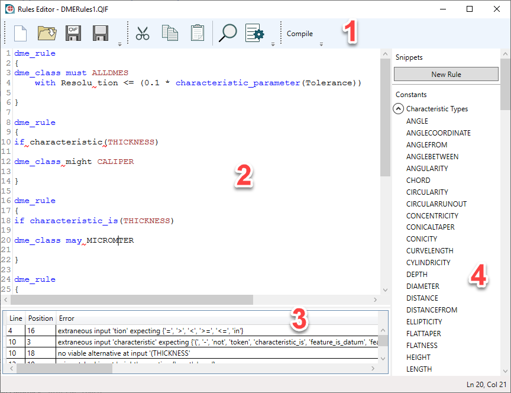

# QIFRulesEditor app
 
The QIF Rules Editor is a C#-based application which provides the capability to create and edit metrology rules in the [ISO QIF](https://www.iso.org/standard/77461.html) format.

For more information about QIF: 

* [QIF Standard Website](https://www.qifstandards.org)
* [QIF Community homepage](https://qualityinformationframework.github.io/)

## User Guide

**[The user guide for the QIF Rules Editor app can be found here.](doc/)**

## What it does

### Core Features

Currently the QIF Rules Editor supports the following operations: 

* Reading QIF documents and trasforming the `Rules` element to the internal Rules Language.
* Writing Rules Languge into a QIF document. If a QIF document has other top-level elements other than `Rules`, those elements are preserved.
* Reading/Writing into Rules Language file.
* Checking Rules Language for errors.
* Creating new documents.

### Interface features

The user interface is built using C#, WPF, and AvalonEdit control. The UI currently supports: 

* Editing the Rules Language presentation of the document.
* Syntax highlighting. Keywords are colored blue and constants are colored brown.
* Undo/Redo.
* Cut, Copy, Paste.
* Opening a document by dragging a file into the text editor’s area.
* Navigation to the error line in the text editor by clicking on the error in the Error Window.
* Error underlining.

Currently, error checking is triggered manually by clicking on the "Compile" button. 

## Interface Overview

The UI consists of 3 main parts: 

1. Toolbar
2. Text Editor
3. Error list window

## Architecture

The application architecture is divided into two parts: (1) rules processing and (2) user interface.

### Rules processing

The figure below gives a brief overview of rules processing architecture. 

 
Two possible workflows are illustrated: 

* from Rules Language to QIF, and
* from QIF to Rules Language

The rules processing relies on the [ANTLR](https://www.antlr.org/) framework. The framework provides a way of describing Rules Language syntax and building an abstract syntax tree (AST). This allows the creation of both an AST from the Rules Language and saving QIF from an AST.

The Rules Object Model is automatically generated by the QIF 3.0 schema and fully reflects the QIF object model.

### User Interface

The user interface is based on the WPF framework using C#. AvalonEdit is used as a text editor control. The latter provides such features as syntax highlighting, error underlining, undo/redo, cut/copy/paste and other things that have not been integrated yet into the app.

## How to build

The QIF Rules Editor is easy to build. All the dependencies are set up as NuGet packages, so all you have to do is load it in Visual Studio 2019 and build.

1. Load the solution `rules_editor.sln` in Visual Studio 2019 (any edition)
2. In the Solution Explorer, right click on the project `rules_editor_wpf` and select "Set as Startup Project"
3. Build the solution
4. Run 

**System requirements**

* Operating system: Windows 7 SP1, Windows 8.1, Windows 10
* .NET Framework 4.7.2

## Copyright

Copyright 2018-2020, Capvidia and QIF Rules Editor contributors

https://www.capvidia.com/

## License

See [License](LICENSE.md)

## Other Libraries

* [ANTLR](https://www.antlr.org/)
* [Avalon Edit](https://github.com/icsharpcode/AvalonEdit)
* [SharpDevelop](https://github.com/icsharpcode/SharpDevelop)
