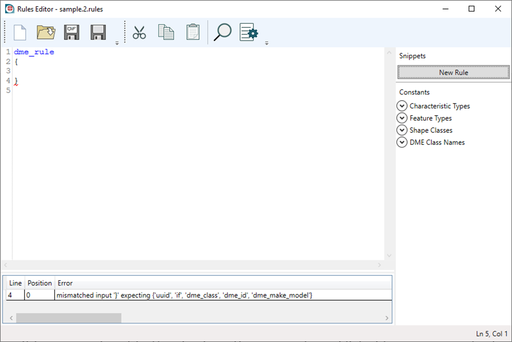

# Rules Editor User’s Guide

The Rules Editor provides the capability to create and edit metrology rules in the QIF format.

## 1 Rules Editor Interface


Rules Editor interface consists of four main parts, shown above:

* Text editor
* Toolbar panel on the top that provides access to the main commands
* Snippet panel on the right that allows to insert pre-defined constructions and constants into the document
* Error list. If text of document has syntax errors, they will be shown here

### 1.1 Text editor features

The text editor provides basic text editing features such as copy/paste, undo/redo, text dragging and file drag-and-drop. There are two important rules editing features. The first one is syntax highlighting. It helps to navigate to the syntax error directly in the editor. The following picture shows the underlined position of a syntax error. 


The second important feature is code completion. It helps you to write rule text by suggesting the continuation from the position of the caret. The text editor opens a suggestion window each time you type a space. You can also call it manually at any time by pressing `ctrl + space` keys simultaneously.


### 1.2 Snippet Panel

The Snippet Panel allows insertion of a new rule or constant into the document.

New rules can be added by clicking on the ‘New Rule’ button. The new rule construction will be inserted at the caret’s position. 

Example:


 
There are 4 groups of constants in the rules language:

* Characteristic types
* Feature types
* Shape classes
* DME Class names

All of them are listed in the snippets panel. A constant can be inserted into the text document by double click.

### 1.3 Error list

The error list contains syntax errors, if the document has any. Double clicking on an error navigates to the corresponding position in the editor.

### 1.4 Toolbar 

The toolbar gives access to the main commands, including the following:

* New document
* Open document from a file
* Save the document to QIF 
* Save as dialog. It saves the document as either .QIF or .rules format
* Cut/Copy/Paste
* Find in the document
* Settings

### 1.5 Settings


The settings window can be opened by clicking on the settings button on the toolbar.

There are four options of text editor available

1.	Show/hide the line numbers
2.	Toggle word wrapping
3.	Highlight the current line in the text editor
4.	Set the font for the text editor

## 2 The Rules Language

A Rules document consists of several rules following each other. Each rule has a structure that can be illustrated as follows:


 
A rule may have the following elements:

* UUID (Universally Unique Identifier) (Optional)
* The ‘if’ part of the rule (Optional)
* Then blocks (At least one is required)

### 2.1 Rules 

All Rules start with the `dme_rule` keyword and its content are enclosed in braces. 

Example:

```
dme_rule
{
    dme_class must ALLDMES
        with Resolution <= characteristic_parameter(Tolerance)*0.1
}
```

### 2.2 UUID

Defines a persistent identifier for the rule. It is an optional block that, if used, must be the first in the rule.

Example:

```
dme_rule
{
    uuid = 00001111-2222-3333-4444-555566667777
    dme_id may 15
}
```

### 2.3 Conditions

Rule conditions start with `if` keyword. 

Example:

```
dme_rule
{
    if characteristic_is(THICKNESS)
    dme_class may CALIPER
}
```

You can make complex and nested conditions using braces and binary logical operators such as ‘and’ and ‘or’. The rules language also supports the unary negation operator ‘not’.

Example:

```
dme_rule
{
    if not feature_is_internal and feature_size < 10
    dme_class may CMM
}
```

### 2.4 Logical functions

The rules language has several logical functions can be used in logical expressions.

#### 2.4.1 characteristic_is

Tests whether a characteristic is of a given type. 

The function has one argument which is a value from characteristic type constants. 

Example:

```
dme_rule
{
    if characteristic_is(THICKNESS)
    dme_class may MICROMETER
}
```

#### 2.4.2 feature_is_datum

Tests whether a feature is a datum.

The function has no arguments.

Example:

```
dme_rule
{
    if feature_is_datum
    dme_id may 15
}
```

#### 2.4.3 feature_is_internal

Tests whether a feature is an internal feature (e.g., a cylindrical hole, as opposed to a pin)

The function has no arguments

Example:

```
dme_rule
{
    if feature_is_internal
    dme_class may ANALOG_MICROMETER
}
```

#### 2.4.4 feature_type_is

Tests whether a feature is of a given type. 

The function has one argument: a value from the feature type constants. 

Example:

```
dme_rule
{
    if feature_type_is(CYLINDER)
    dme_make_model may manufacturer = "Renishaw" model_number = "PH9"
}
```

#### 2.4.5 sampling_category_is

Tests whether a sampling category equals a given value. 

The function has one argument: an integer value.

Example:

```
dme_rule
{
    if sampling_category_is(7)
    dme_class may CMM
}
```

#### 2.4.6 shape_class_is

Tests whether a part is in a given shape class. 

The function has one argument: a value from the shape class constants.

Example:

```
dme_rule
{
    if shape_class_is(FREEFORM)
    dme_id must not 1551
}
```

### 2.5 Arithmetic expressions

You can use arithmetic expressions within a logical expression. You can compare numerical values using comparison operators such as `=`, `<`, `>`, `<=`, `>=`. 

Example:

```
dme_rule
{
        if feature_size < 5.0 and characteristic_parameter(Tolerance) >= 0.1000

        dme_class may ANALOG_MICROMETER
}
```

There are also several functions that represents numerical values.

#### 2.5.1 feature_parameter

Represents a value of an arithmetic parameter of a feature. If the feature under consideration does not have the given parameter, rules containing the `feature_parameter` function do not apply. 

The function has two parameters:

|   |   |   |
|---|---|---|
| 1  | xpath  | xpath to the parameter starting from the feature  |
| 2  | Feature type  | Optional. If it is specified, the rule containing the ‘feature_parameter’ function applies only to features of the given type  |

Example:

```
dme_rule
{
    if feature_parameter(HalfAngle, CONE) < 1
    dme_class may ALLDMES
}
```

#### 2.5.2 characteristic_parameter

Represents a value of an arithmetic parameter of a characteristic. If the characteristic under consideration does not have the given parameter, rules containing the ‘characteristic_parameter’ function do not apply.

The function has two parameters:

|   |   |   |
|---|---|---|
| 1  | xpath  | xpath to the parameter starting from the characteristic  |
| 2  | Characteristic type  | Optional. If it is specified, the rule containing the ‘characteristic_parameter’ function applies only to characteristics of the given type  |

Example:

```
dme_rule
{
    if characteristic_parameter(ToleranceValue) >= 0.2
    dme_class may CARTESIAN_CMM
}
```

#### 2.5.3 characteristic_tolerance

Defines an arithmetic expression representing the tolerance range of a characteristic. The ‘characteristic_tolerance’ evaluates to the difference between the MaxValue and MinValue given in the tolerance of the characteristic. 

The function has no parameters.

Example:

```
dme_rule
{
    if characteristic_tolerance < 0.010
    dme_class may CARTESIAN_CMM
}
```

#### 2.5.4 dme_parameter

Represents a value of an arithmetic parameter of a DME. If the DME under consideration does not have the given parameter, rules containing the ‘dme_parameter’ function do not apply.

The function has two parameters

|   |   |   |
|---|---|---|
| 1  | xpath  | xpath to the parameter starting from the DME  |
| 2  | DME class type  | Optional. If it is specified, the rule containing the ‘dme_parameter’ function applies only to DME of the given type  |

Example:

```
dme_rule
{
    if dme_parameter(CartesianWorkingVolume/XAxisLength, UNIVERSAL_DEVICE)
        *dme_parameter(CartesianWorkingVolume/YAxisLength, UNIVERSAL_DEVICE)
        *dme_parameter(CartesianWorkingVolume/ZAxisLength, UNIVERSAL_DEVICE)
        >=
        1.5*part_parameter(PartFamily/MinimumBoundingBox/Length)
        *part_parameter(PartFamily/MinimumBoundingBox/Width)
        *part_parameter(PartFamily/MinimumBoundingBox/Height)
    dme_class may UNIVERSAL_DEVICE
}
```

#### 2.5.5 part_parameter

Represents a value of an arithmetic parameters of the part being inspected. If the part under consideration does not have the given parameter, rules containing ‘part_parameter’ do not apply.

The function has one parameter:

|   |   |   |
|---|---|---|
| 1  | xpath  | xpath to parameter starting from the part  |

Example:

```
dme_rule
{
    if part_parameter(PartFamily/MinimumBoundingBox/Length) <= 1200
    and part_parameter(PartFamily/MinimumBoundingBox/Length) >= 500
    and part_parameter(PartFamily/MinimumBoundingBox/Width) <= 1200
    and part_parameter(PartFamily/MinimumBoundingBox/Width) >= 500
    and part_parameter(PartFamily/MinimumBoundingBox/Height) <= 1500
    and part_parameter(PartFamily/MinimumBoundingBox/Height) >= 500
        
    dme_class may CARTESIAN_CMM
}
```

#### 2.5.6 feature_length

Represents a length of a feature under consideration. 

The function has no parameters.

Example:

```
dme_rule
{
    if feature_length < 0.5
    dme_class may CARTESIAN_CMM
}
```

#### 2.5.7 feature_area

Represents an area of a feature under consideration. 

The function has no parameters.

Example:

```
dme_rule
{
    if feature_area < 25.0
    dme_class may CARTESIAN_CMM
}
```

#### 2.5.8 feature_size

Represents a size of a feature under consideration. 

The function has no parameters.

Example:

```
dme_rule
{
    if feature_size < 4
    dme_class may CARTESIAN_CMM
}
```

#### 2.5.9 max

Represents a value which is maximum from all specified values or arithmetic expression.

The function might have multiple arguments.

Example:

```
dme_rule
{
    if max(part_parameter(PartFamily/MinimumBoundingBox/Length), 
            part_parameter(PartFamily/MinimumBoundingBox/Width),
            part_parameter(PartFamily/MinimumBoundingBox/Height)) < 1500
        
    dme_class may CARTESIAN_CMM
}
```

#### 2.5.10 min

Represents a value which is minimum from all specified values or arithmetic expression.

The function might have multiple arguments.

Example:

```
dme_rule
{
    if min(part_parameter(PartFamily/MinimumBoundingBox/Length), 
            part_parameter(PartFamily/MinimumBoundingBox/Width),
            part_parameter(PartFamily/MinimumBoundingBox/Height)) > 100
        
    dme_class may CARTESIAN_CMM
}
```

### 2.6 Then blocks

Then blocks set constraints on the decision about one or more DME. There are three types of then expressions in the Rules language. 

#### 2.6.1 dme_class

Defines a decision in which a DME must, must not or may be selected. A set of constraints on parameters of the DME being considered can be added optionally.

Example:

```
dme_rule
{
    dme_class must not AACMM
    dme_class may CALIPER
}
dme_rule
{
    dme_class must DIGITAL_MICROMETER
}
```

The constraint is written in the following form:

`<xpath> <comparison_literal> <arithmetic_expression>`

where:

`xpath` is the xpath to a numerical-valued parameter of the class of DME being considered.

`comparison_literal` is comparison symbol such as `=`, `<`, `>`, `<=`, `>=`.

`arithmetic_expression` is an arithmetic expression.

Examples:

```
dme_rule
{
    dme_class may CARTESIAN_CMM
        with CartesianWorkingVolume/XAxisLength >= 800
        with CartesianWorkingVolume/XAxisLength <= 1500
        with CartesianWorkingVolume/YAxisLength >= 800
        with CartesianWorkingVolume/YAxisLength <= 1500
        with CartesianWorkingVolume/ZAxisLength >= 1000
        with CartesianWorkingVolume/ZAxisLength <= 2000
        with CartesianResolution/CombinedCartesianResolution >= 0.01
        with CartesianResolution/CombinedCartesianResolution <= 0.02
        with EnvironmentalRange/MinAmbientTemperature >= 20
        with EnvironmentalRange/MaxAmbientTemperature <= 25
}
```

#### 2.6.2 dme_id

Defines a decision in which a specific DME must, must not, or may be selected by id.

Example:

```
dme_rule
{
    dme_id must not 100100
    dme_id may 100021
}
dme_rule
{
    dme_id must 100011
}
```

#### 2.6.3 dme_make_model

Defines a decision in which a specific DME must, must not, or may be selected by its manufacturer, model number, and optionally its serial number.

Example:

```
dme_rule
{
dme_make_model must not
    manufacturer = "Sample Manufacturer"
    model_number = "P14"
    serial_number = "000111995512"
}
```